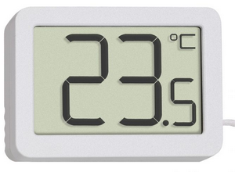

<br />



# Fonctions du thermomètre
```txt
- acquérir la température d'une pièce intérieure
- afficher la température sur un afFicheur LCD
```
<br />

# Objectif
```txt
- valider la résolution obtenue (calculée et simulée) par rapport à la précision du capteur.
```
> Remarque : il faut que la résolution soit plus petite que la précision du capteur afin de bénéficier de cette précision.

> Pour plus d'informations cliquer sur le lien suivant : <a href="https://sensorpartners.com/fr/base-de-connaissances/resolution-et-precision-des-capteurs/" target="_blank">Sensor Partners</a>.

<br />

# Cahier des charges
``` txt
- résolution minimale attendue de la chaîne de mesure : 0,15°C
- plage de mesure : [0°C ; 100°C]
```
<br />

# Moyens
```txt
- Isis : logiciel de saisie de schéma et de simulation
- Arduino : environnement de développement intégré
```
<br />

# Compte-rendu
> Vous répondrez aux questions Qx. sur un document numérique LibreOffice.
À la fin du TD vous remettrez dans un dossier zippé nommé `digital_thermometer_votre_nom.zip` les fichiers suivants :
```
├───CR-Ciel.odt
├───digital_thermometer.dsn      
├───arduino_source
│      ├───arduino_source.ino
```
> Modèle de compte-rendu : <a href="../files/CR-Ciel.odt" target="_blank">CR-Ciel.odt</a>.

<br />
<br />

> 
Auteur : Franck RIVIER - lycée Rouvière (TOULON)