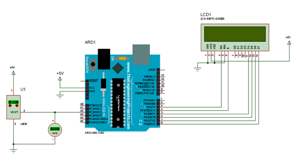

<br />



# Simulation Isis
> __Objectif__ : déterminer la résolution du thermonmètre

```txt
- Ouvrir le fichier Isis qui simule le comportement du thermomètre et qui affiche sur l'afficheur LCD le code N en décimal en sortie du CAN.
```
> <a href="../files/digital_thermometer.zip" target="_blank">Thermomètre numérique Isis</a>
```txt
- Simuler le thermomètre numérique.
- Faire varier la température du LM35 en cliquant sur les flèches et déterminer la plus petite variation de température qui permet de faire varier la sortie N du CAN de 1 LSB.
- Vérifier que le thermomètre se comporte correctement dans toute la plage de mesure.
```
> Astuce : il est possible de modifier le pas de variation de la température en double-cliquant sur le LM35 et en mettant une valeur de 1 par exemple dans le champ `Temperature step(°C)`.

```txt
    Q1. En déduire la résolution du thermomètre en °C/LSB.
```

<br />

# Étude du capteur

    À partir de la documentation du LM35 :    
        Q2. Relever la précision du LM35 pour une température ambiante (room temperature).
        Q3. Relever la précision du LM35 pour une plage de variation de la température comprise entre 0°C et 100°C.
        Q4. Relever la sensibilité du LM35 (en mV/°C).
> <a href="../files/lm35.pdf" target="_blank">Documentation du lm35</a>

<br />

# Étude du CAN

    À partir de la documentation Arduino : 
        Q5. Calculer le quantum q du CAN de la carte Arduino Uno.        
> <a href="https://docs.arduino.cc/language-reference/en/functions/analog-io/analogRead/" target="_blank">Arduino Docs - analogRead()</a>

<br />

# Formule de la tension
> __Méthode__ : à partir de la sortie N du CAN on peut calculer une approximation de la tension Us présente en entrée du CAN : Us = N * q

        Q6. Donner la formule de Us en fonction de N, Uref et n.   

<br />

# Formule de la température
> __Méthode__ : à partir de la sensibilité du LM35 on obtient une relation entre la tension Us et la température T en °C.
    
        Q7. Donner la formule de Us en fonction de T.

<br /> 

# Calcul de la température
> __Définition__ : la résolution est la plus petite variation de la mesure qui provoque un changement de 1 LSB en sortie du CAN.

        Q8. Grâce aux deux formules précédentes donner la formule qui permettra à l'Arduino Uno de calculer la température en fonction de N.
        Q9. En déduire la valeur de la résolution du thermomètre en °C/LSB.
        Q10. Est-ce que cette résolution est satisfaisante (voir cahier des charges) ?

<br />

# Amélioration
> __Méthode__ : la résolution peut être améliorée de deux manières :

1. Augmenter la sensibilité du capteur (amplification de la sortie du LM35) tout en restant dans la plage de conversion du CAN de l'Arduino Uno. Cette solution nécessite l'ajout d'un amplificateur ainsi que le réglage correcte de son amplification.
2. Abaisser la tension de référence du CAN tout en conservant la plage de mesure. Cette solution est plus simple car il suffit d'ajouter une ligne de programmation.
> <a href="https://docs.arduino.cc/language-reference/en/functions/analog-io/analogReference/" target="_blank">Arduino Docs - analogReference()</a>

```
- Ouvrir le fichier source Arduino.
```
> <a href="../files/arduino_source.zip" target="_blank">Fichier source Arduino</a>

- Dans l'IDE Arduino cliquer sur `Croquis`-> `Exporter les binaires compilés`, ce qui provoque la compilation et la génération du `fichier texte au format intel HEX` (représentant le programme en langage machine).
- Ce fichier se trouve au même endroit que votre programme Arduino.
- Dans Isis double-cliquer sur l'Arduino Uno et au niveau du champ `Program Files:` cliquer sur l'icône Ouvrir et sélectionner le `fichier HEX`.
```txt
- Lancer la simulation sous Isis.
```
> L'afficheur affiche cette fois N et la température calculée.

```yxt
- Vérifier que la température affichée est proche de la température mesurée.
- Vérifier que le thermomètre fonctionne toujours correctement dans la plage de mesure du cahier des charges.
- Vérifier que l'affichage de la température évolue par "bonds" qui correspondent à la résolution du thermomètre calculée précédemment.
```
```txt
- Modifier le programme précédent pour améliorer la résolution du thermomètre.
```
> __Indice__ : il faudra tout d'abord modifier la tension de référence dans le `setup()` puis modifier le calcul de la température en conséquence dans le `loop()` (le quantum chamge).


```txt
- Simuler votre nouveau programme et vérifier que :
    - l'affichage de la température est correct ;
    - la résolution est meilleure.
    Q11. Déterminer par simulation puis par calcul la nouvelle résolution obtenue.
    Q12. Valider cette résolution par rapport à la précision du LM35.
```
<br />
<br />

> 

> <a href="https://creativecommons.org/licenses/by-nc-sa/4.0/" target="_blank">Termes de la licence</a>

> Auteur : Franck RIVIER - lycée Rouvière (TOULON)
